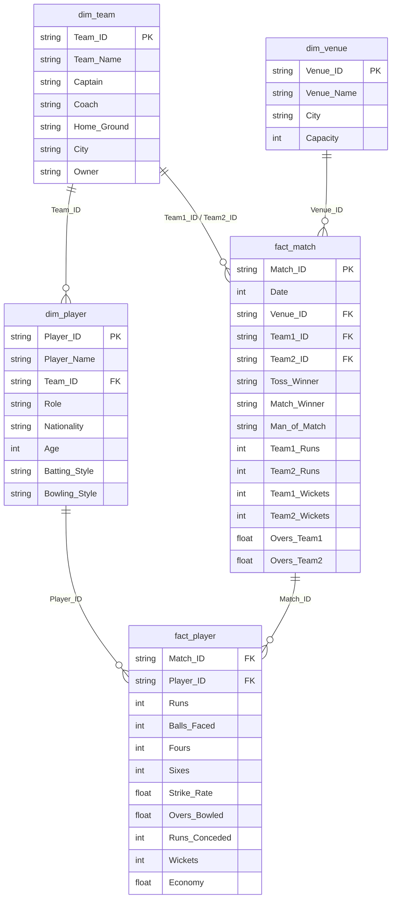

<div align="center">


# 🏏 IPL 2025 Interactive Analytics Dashboard & Data Model

[](https://www.microsoft.com/excel)
[](https://en.wikipedia.org/wiki/Star_schema)
[](https://www.iplt20.com)
[](LICENSE)
[](https://github.com/DhruvPanchal0312/IPL-Dashboard-2025/stargazers)

**A high-performance, business intelligence Excel project featuring Star Schema dimensional modeling, dynamic Pivot engines, multi-dimensional Slicers, and dual executive dashboards analyzing 60 IPL 2025 matches, 8 franchises, 10 iconic venues, and 33 star players.**

[Overview](#-project-overview) • [Dashboard Architecture](#-dashboard-views) • [Data Model & Schema](#-star-schema-data-model) • [Key Metrics](#-key-metrics--kpis) • [Excel Techniques](#-advanced-excel-techniques) • [How to Run](#-quick-start-guide) • [Author](#-author)

---

</div>

## 📌 Project Overview

The **IPL 2025 Analytics Dashboard** is an enterprise-grade spreadsheet analytics solution built in Microsoft Excel. Rather than relying on static, flat tables, this project applies **relational data engineering and Star Schema dimensional modeling** to simulate and evaluate the complete IPL 2025 tournament.

By decoupling dimension entities (*teams, players, venues*) from transaction facts (*matches, ball-by-ball player performances*), the workbook provides seamless cross-filtering, dynamic aggregations, and sub-second calculation performance across **20,900+ tournament runs** and **790+ wickets**.

---

## 🎯 Tournament at a Glance

<div align="center">

| 🏆 Total Matches | 👥 Franchises | 🏟️ Venues | 🏏 Total Runs | 🎯 Total Wickets | ⭐ Tracked Players |
| :---: | :---: | :---: | :---: | :---: | :---: |
| **60** | **8** | **10** | **20,944** | **799** | **33** |

</div>

---

## 📊 Dual Executive Dashboard Views

The workbook `IPL Dashbaord.xlsx` contains two dedicated analytical interfaces:

```
┌────────────────────────────────────────────────────────────────────────┐
│                        IPL DASHBOARD WORKBOOK                          │
├───────────────────────────────────┬────────────────────────────────────┤
│   1️⃣ Team Performance Dashboard   │    2️⃣ Player Performance Summary   │
│   • 4 Live KPI Cards              │    • 2 Live KPI Cards              │
│   • Team & Venue Slicers          │    • Player Name Slicer            │
│   • Wins by Match Type            │    • Player vs Runs Leaderboard    │
│   • Team vs Wins Ranking          │    • Player vs Wickets Tally       │
│   • Runs by Franchise             │    • Batting Strike Rate Analysis  │
│   • Venue Match Distribution      │    • Bowling Economy Comparison    │
└───────────────────────────────────┴────────────────────────────────────┘
```

### 1. 🛡️ Team Performance Dashboard
Designed for franchise strategists, coaches, and sports analysts:
- **Dynamic KPI Cards**:
  - `TOTAL MATCHES`: **60** matches (dynamically extracted via `GETPIVOTDATA`)
  - `TOTAL TEAMS`: **8** premier franchises
  - `TOTAL RUNS`: **20,944** tournament runs
  - `TOTAL WICKETS`: **799** total dismissals
- **Interactive Multi-Slicers**:
  - `Team_Name` Slicer — Slice by franchise (CSK, MI, RCB, KKR, DC, RR, PBKS, SRH).
  - `Venue_Name` Slicer — Filter by individual stadium conditions.
- **Visual Analytics**:
  - 📊 **Team vs Wins**: Comprehensive win leaderboard (led by CSK with 5 wins in sample window).
  - 📈 **Runs vs Teams**: Cumulative run scoring volume per franchise.
  - 🏟️ **Venue vs Match Played**: Fixture distribution across stadiums.
  - 🍩 **Wins by Type**: Proportional breakdown of **Win by Runs** (13,297 runs) vs. **Win by Wickets** (7,647 runs), illuminating defending vs. chasing success rates.

### 2. ⚡ Player Performance Summary
Designed for individual performance evaluation, auction insights, and form tracking:
- **Dynamic KPI Cards**:
  - `TOTAL PLAYERS`: **33** marquee international & domestic cricketers (`=ROWS(dim_player!B2:B34)`)
  - `TOTAL WICKETS`: **178** tracked bowler dismissals
- **Interactive Slicers**:
  - `Player_Name` Slicer — Instant drill-down into specific player career & season stats.
- **Visual Analytics**:
  - 🏏 **Player vs Runs**: Top run-scorers and Orange Cap contenders.
  - 🎯 **Player vs Wickets**: Leading wicket-takers and Purple Cap contenders.
  - ⚡ **Strike Rate Metrics**: Batting aggression across scoring phases.
  - 🛡️ **Economy Rates**: Thriftiness of pace and spin bowlers.

---

## 🏗️ Star Schema Data Model

The project is structured according to Kimball dimensional modeling principles, separating dimension attributes from granular transactional facts:



### Table Dictionary

| Table | Type | Records | Description & Key Fields |
| :--- | :---: | :---: | :--- |
| **`dim_team`** | Dimension | 8 | Franchise profiles: Captain, Coach, Home Ground, City, Owner |
| **`dim_player`** | Dimension | 33 | Player master: Role (Batsman, Bowler, All-Rounder, Wicketkeeper), Nationality, Age, Batting/Bowling styles |
| **`dim_venue`** | Dimension | 10 | Stadium directory: City, Seating Capacity (ranging up to 132,000 at Narendra Modi Stadium) |
| **`fact_match`** | Fact | 60 | Match transactions: Date, Teams, Toss Winner, Match Winner, Player of Match, Scores & Overs |
| **`fact_player`** | Fact | 201 | Granular player performances per match: Runs, Balls, 4s, 6s, SR, Overs, Conceded, Wickets, Economy |

---

## 🏟️ Participating Franchises & Venues

<details>
<summary><b>Click to expand Franchise Master List</b></summary>

| Team Code | Franchise | Captain | Head Coach | Home Stadium |
| :---: | :--- | :--- | :--- | :--- |
| **T01** | Mumbai Indians (MI) | Rohit Sharma | Mark Boucher | Wankhede Stadium, Mumbai |
| **T02** | Chennai Super Kings (CSK) | Ruturaj Gaikwad | Stephen Fleming | M. A. Chidambaram Stadium, Chennai |
| **T03** | Royal Challengers Bengaluru (RCB) | Faf du Plessis | Andy Flower | M. Chinnaswamy Stadium, Bengaluru |
| **T04** | Kolkata Knight Riders (KKR) | Shreyas Iyer | Chandrakant Pandit | Eden Gardens, Kolkata |
| **T05** | Delhi Capitals (DC) | Rishabh Pant | Ricky Ponting | Arun Jaitley Stadium, Delhi |
| **T06** | Rajasthan Royals (RR) | Sanju Samson | Kumar Sangakkara | Sawai Mansingh Stadium, Jaipur |
| **T07** | Punjab Kings (PBKS) | Shikhar Dhawan | Trevor Bayliss | Maharaja Yadavindra Singh Stadium, Mohali |
| **T08** | Sunrisers Hyderabad (SRH) | Pat Cummins | Daniel Vettori | Rajiv Gandhi Int. Stadium, Hyderabad |

</details>

<details>
<summary><b>Click to expand Stadiums & Capacity List</b></summary>

| Venue ID | Stadium Name | Host City | Seating Capacity |
| :---: | :--- | :--- | :---: |
| **V01** | Wankhede Stadium | Mumbai | 33,108 |
| **V02** | M. A. Chidambaram Stadium (Chepauk) | Chennai | 38,000 |
| **V03** | M. Chinnaswamy Stadium | Bengaluru | 42,000 |
| **V04** | Eden Gardens | Kolkata | 68,000 |
| **V05** | Arun Jaitley Stadium | Delhi | 41,820 |
| **V06** | Sawai Mansingh Stadium | Jaipur | 30,000 |
| **V07** | Maharaja Yadavindra Singh Cricket Stadium | Mohali | 38,000 |
| **V08** | Rajiv Gandhi International Cricket Stadium | Hyderabad | 39,200 |
| **V09** | Narendra Modi Stadium | Ahmedabad | 132,000 |
| **V10** | BRSABV Ekana Cricket Stadium | Lucknow | 50,000 |

</details>

---

## 🧮 Advanced Excel Techniques

1. **Dynamic Pivot Integration (`GETPIVOTDATA`)**:
   - Decoupled card visualizations from hardcoded figures:
     ```excel
     =GETPIVOTDATA("[Measures].[Count of Match_ID]", Team_Summary!$A$3)
     =GETPIVOTDATA("[Measures].[Total Runs]", Team_Summary!$A$3)
     =GETPIVOTDATA("[Measures].[Total Wickets]", Team_Summary!$A$3)
     ```
2. **Dynamic Range Calculation**:
   - Automated player count tracking:
     ```excel
     =ROWS(dim_player!B2:B34)
     ```
3. **Cross-Table Slicer Cache Connections**:
   - Connected `Slicer_Team_Name`, `Slicer_Venue_Name`, and `Slicer_Player_Name` across 10+ PivotTables simultaneously, enabling instantaneous multi-dimensional filtering.
4. **Relational Integrity**:
   - Star Schema modeled keys (`Team_ID`, `Player_ID`, `Venue_ID`, `Match_ID`) ensuring seamless lookup without redundant text replication.

---

## 📂 Repository File Structure

```text
IPL-Dashboard-2025/
│
├── 📊 IPL Dashbaord.xlsx       # Primary interactive workbook (Dashboards, Pivots, Slicers)
├── 📊 IPL 2025.xlsx            # Clean dimensional model workbook (Star Schema tables)
├── 📁 assets/
│   └── 🖼️ IPL Logo.png         # Official high-resolution IPL tournament logo
├── 📄 .gitignore               # Ignored system and temporary lock files
└── 📄 README.md                # Comprehensive documentation
```

---

## 🚀 Quick Start Guide

1. **Clone this repository**:
   ```bash
   git clone https://github.com/DhruvPanchal0312/IPL-Dashboard-2025.git
   cd IPL-Dashboard-2025
   ```

2. **Open the Dashboard**:
   - Double click **`IPL Dashbaord.xlsx`** in **Microsoft Excel (2019, 2021, or Office 365 recommended)**.
   - When opened, select **"Enable Editing"** and **"Enable Content"** to allow data connections and Pivot Slicers to update dynamically.

3. **Navigate & Filter**:
   - Switch between the **`Team Performance Dashboard`** and **`Player Performance Summary`** tabs.
   - Click on any **Franchise**, **Venue**, or **Player** in the Slicers to watch all charts and KPI numbers re-calculate in real time.
   - Click the **Clear Filter** icon (`Alt + C`) on any slicer to return to tournament-wide totals.

---

## 👤 Author

**Dhruv Panchal**
- 🐙 **GitHub**: [@DhruvPanchal0312](https://github.com/DhruvPanchal0312)
- 📂 **Repository**: [IPL-Dashboard-2025](https://github.com/DhruvPanchal0312/IPL-Dashboard-2025)

---

<div align="center">

**⭐ If you found this dashboard and data model useful, please consider giving this repository a star! ⭐**

</div>
